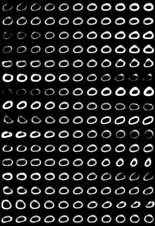
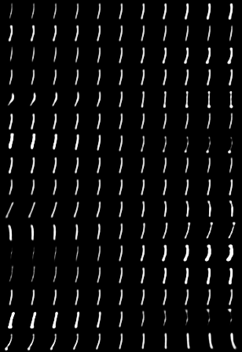
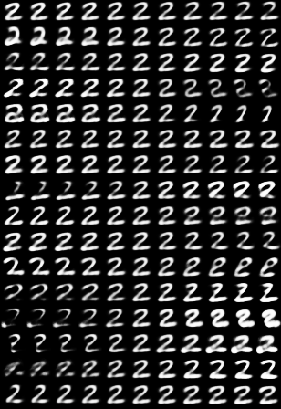
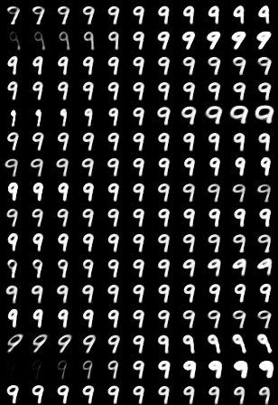

# カプセルネットワークをkerasで実装
[](https://github.com/XifengGuo/CapsNet-Keras/blob/master/LICENSE)

## 背景
　2017年, ディープラーニング界にまたしても新たな技術が生み出されました. Googleの研究員,Geoffrey E. Hinton(ジェフリーヒントん)さんが発表した論文(Dynamic Routing Between Capsules)でカプセルネットワークという手法が提案されました. この手法を[Xifeng Guo](https://github.com/XifengGuo)さんがkerasで実装されていましたので, ほとんど真似しながら実装し,説明等を日本語訳しました. カプセルネットワークの理解に関しましては本ページでは扱いませんので, 本ページ末尾のリンク集を一通り読んでいただければ実装できるかと思われます.

論文へのリンクは[こちら](http://papers.nips.cc/paper/6975-dynamic-routing-between-capsules.pdf)

 
## 論文と異なる点
- `decay factor = 0.9` `step = 1 epoch`とした.
論文では細かいパラメータまでは指定されていなかった.
- エポック数を50とした
論文では1250エポック
- reconstruction loss関数にMSE(mean squared error)を使用した. and 
論文ではEES(sum squared error)
※reconstruction loss関数とはdecoderの出力を教師データと比較し, ロスを計算するもの.
- `lam_recon=0.0005*784=0.392`とした.   
論文では`lam_recon=0.0005`


## 使用方法

### ■Step 1. インストール
[TensorFlow>=1.2](https://github.com/tensorflow/tensorflow)
[Keras>=2.0.7](https://github.com/fchollet/keras)をインストール 
```
pip install tensorflow-gpu
pip install keras
```

### ■Step 2. リポジトリをクローン
```
git clone https://github.com/XifengGuo/CapsNet-Keras.git capsnet-keras
cd capsnet-keras
```

### ■Step 3. 実行

デフォルト設定
```
python capsulenet.py
```

ヘルプ機能
```
python capsulenet.py -h
```

### ■Step 4. モデル検証

下記のコマンドで`result/trained_model.h5`にモデルを保存することができます.
```
$ python capsulenet.py -t -w result/trained_model.h5
```
テストaccuracyと再構成された画像を出力してくれます.

学習済みモデルのダウンロードは[こちら](https://pan.baidu.com/s/1sldqQo1)


### ■Step 5. GPUで学習

(注)Keras 2.0.9が必要ですので満たしていない方はアップデートをしてください.  
```
python capsulenet-multi-gpu.py --gpus 2
```
このコマンドで自動的にGPUを用いて処理してくれます. なお,トレーニング中はaccuracyを出力しません.

## 結果

#### テストエラー率  

平均と標準偏差は3回行った結果です.  
この結果は下記のコマンドで出力できます.

 ```
 python capsulenet.py --routings 1 --lam_recon 0.0    #CapsNet-v1   
 python capsulenet.py --routings 1 --lam_recon 0.392  #CapsNet-v2
 python capsulenet.py --routings 3 --lam_recon 0.0    #CapsNet-v3 
 python capsulenet.py --routings 3 --lam_recon 0.392  #CapsNet-v4
```
   Method     |   Routing   |   Reconstruction  |  MNIST (%)  |  *Paper*    
   :---------|:------:|:---:|:----:|:----:
   Baseline |  -- | -- | --             | *0.39* 
   CapsNet-v1 |  1 | no | 0.39 (0.024)  | *0.34 (0.032)* 
   CapsNet-v2  |  1 | yes | 0.36 (0.009)| *0.29 (0.011)*
   CapsNet-v3 |  3 | no | 0.40 (0.016)  | *0.35 (0.036)*
   CapsNet-v4  |  3 | yes| 0.34 (0.016) | *0.25 (0.005)*
   
lossとaccuracyのグラフ:


#### 学習速度

|実行環境|速度|
|:--|:--|
|single GTX 1070 GPU|約`100s / epoch`|
|single GTX 1080Ti GPU|約`80s / epoch`| 
|two GTX 1080Ti GPU(`capsulenet-multi-gpu.py`を使用)|約`55s / epoch`|

#### 再構成結果  
これらはCapsNet-v4の結果です.
```
python capsulenet.py -t -w result/trained_model.h5
```
上段5つはMNISTからの生データ  
下段5つがそれぞれに対応する再構成データ


#### Manipulate latent code

```
python capsulenet.py -t --digit 5 -w result/trained_model.h5 
```
それぞれの数字において, i番目の数字はi番目のカプセルに対応します.  
左の列から順に`[-0.25, -0.2, -0.15, -0.1, -0.05, 0, 0.05, 0.1, 0.15, 0.2, 0.25]`というカプセルの次元の値となっています.

それぞれの数字の特徴をしっかりとつかめているように見受けられますね.  
同じ次元でも別の数字では異なる書き方をされていますが, これは異なる特徴ベクトル(feature vectors)またはカプセル(digit capsules)から生成されているためです.









## 別の手法

- PyTorch:
  - [XifengGuo/CapsNet-Pytorch](https://github.com/XifengGuo/CapsNet-Pytorch)
  - [timomernick/pytorch-capsule](https://github.com/timomernick/pytorch-capsule)
  - [gram-ai/capsule-networks](https://github.com/gram-ai/capsule-networks)
  - [nishnik/CapsNet-PyTorch](https://github.com/nishnik/CapsNet-PyTorch.git)
  - [leftthomas/CapsNet](https://github.com/leftthomas/CapsNet)
  
- TensorFlow:
  - [naturomics/CapsNet-Tensorflow](https://github.com/naturomics/CapsNet-Tensorflow.git)   
  I referred to some functions in this repository.
  - [InnerPeace-Wu/CapsNet-tensorflow](https://github.com/InnerPeace-Wu/CapsNet-tensorflow)   
  - [chrislybaer/capsules-tensorflow](https://github.com/chrislybaer/capsules-tensorflow)

- MXNet:
  - [AaronLeong/CapsNet_Mxnet](https://github.com/AaronLeong/CapsNet_Mxnet)
  
- Chainer:
  - [soskek/dynamic_routing_between_capsules](https://github.com/soskek/dynamic_routing_between_capsules)

- Matlab:
  - [yechengxi/LightCapsNet](https://github.com/yechengxi/LightCapsNet)

## リンク集
- python 
    - [python入門](http://www.tohoho-web.com/python/)
- keras
    - [keras公式ドキュメント](https://keras.io/ja/)
- ディープラーニング
    - [機械学習ざっくりまとめ](https://qiita.com/frost_star/items/21de02ce0d77a156f53d)
    - [オススメの本](https://www.oreilly.co.jp/books/9784873117584/)
- カプセルネットワーク 
    - [元論文](http://papers.nips.cc/paper/6975-dynamic-routing-between-capsules.pdf)
    - [世界一わかりやすいカプセルネットワーク](http://blog.aidemy.net/entry/2017/12/03/052302)
    - [カプセルネットワークはニューラルネットワークを超えるか。](https://qiita.com/hiyoko9t/items/f426cba38b6ca1a7aa2b)
    - [グーグルの天才AI研究者、ニューラルネットワークを超えるカプセルネットワークを発表](https://wired.jp/2017/11/28/google-capsule-networks/)
    - [CapsNetのPytorch実装](https://qiita.com/motokimura/items/cae9defed10cb5efeb62)
